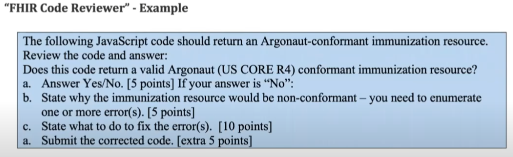
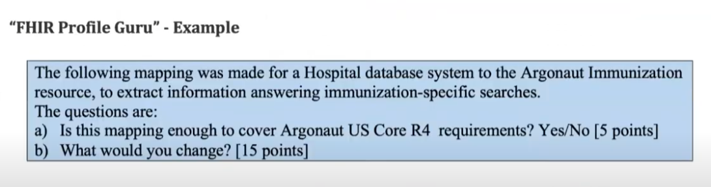
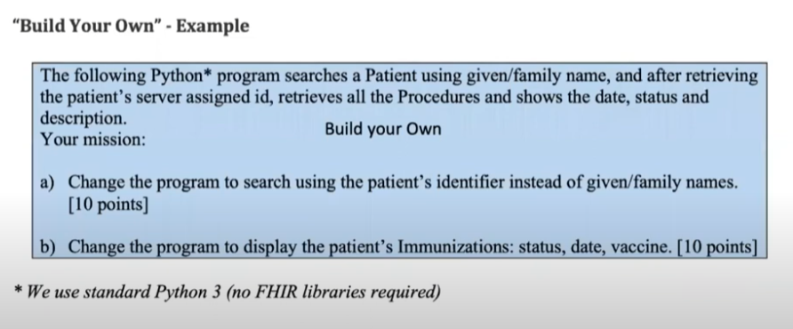
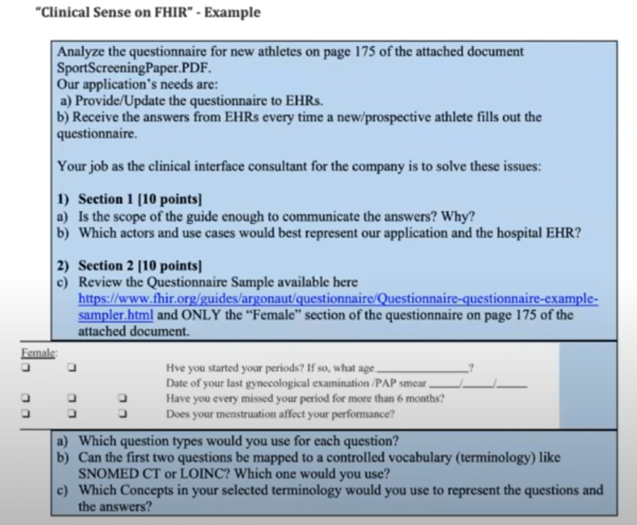
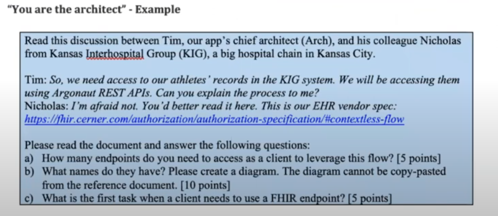

# Agenda

- [Agenda](#agenda)
  - [Assignment Variety](#assignment-variety)
  - [Assignment Types](#assignment-types)
  - [Grading and Course Completion](#grading-and-course-completion)
  - [Description and Examples](#description-and-examples)
    - [FHIR Code Reviewer](#fhir-code-reviewer)
    - [FHIR Profile Guru](#fhir-profile-guru)
    - [Build Your Own](#build-your-own)
    - [Clinical Sense on FHIR](#clinical-sense-on-fhir)
    - [You are the Architect](#you-are-the-architect)
  - [Closing Remarks](#closing-remarks)

## Assignment Variety

 * Learn by Doing
   * The source is based on ***you*** creating, editing, reviewing working code, artifacts or specs.
 * Trying to accomodate to *each person's skills and needs*

## Assignment Types

 * FHIR Code Reviewer
 * FHIR Profile Guru
 * Build Your Own
 * Clinical Sense on FHIR
 * You are the Architect

## Grading and Course Completion

 * **Questionaires:**
   * You need to **complete all the questionaires**, one for each unit.
   * Minimum grade: **60/100**.
   * Deadline: **end of the course**
 * **Assignments:**
   * Each unit has **zero or more** assignments of each type.
   * Each assignment will give **you between** *10 and 30 points*, depending on complexity.
   * You need to **sum a** *minimum of 60 points* **in each unit**, to complete the course. **NOTE:** Micro-assignments don't count.
   * Deadline:
     * **Unit 1:** 2 weeks
     * **Unit 2:** 3 weeks
     * **Unit 3:** 3 weeks
     * **Unit 4:** 2 weeks from release

## Description and Examples  

### FHIR Code Reviewer

 * We will present a **small code snippet** for you to identify **one or more existing problems, by inspection.**
 * Language/good practices/coding standards does not matter: **only FHIR compliant / IG conformance**
 * We use a variety of languages:
   * [JavaScript](https://javascript.info/)
   * [Java](https://www.java.com/en/)
   * [Python](https://www.python.org/)
   * [C#](https://dotnet.microsoft.com/en-us/languages/csharp)
 * The code should be commented and self-explaining
  

### FHIR Profile Guru

 * We will present or request some **mapping** from legacy system to a FHIR resource.
 * Determine whether a particular use of an element **is or not the intended** use in the Implementation Guide
 * This kind of assignment will **test your (brand new) knowledge** of the **Argonaut and FHIR IPS implementation guides**

### Build Your Own

 * We will ask you to **complete an existing solution** by adding new capabilities to code that already does its intended job, or to **adapt a solution** to do something similiar.
 * We use a variety of languages:
   * [JavaScript](https://javascript.info/)
   * [Java](https://www.java.com/en/)
   * [Python](https://www.python.org/)
   * [C#](https://dotnet.microsoft.com/en-us/languages/csharp)
 * Youu can familiarize yourself with the code **to understand what it does**, and prove that you can **extend the functionality** for a new scope.
 * **NOTE:** Units 3 and 4 (Client/Server): Most assignments are "Build Your Own"

### Clinical Sense on FHIR

 * We will present you a problem or use-case/scenario that may include reasoning about **how to map certain clinical information, specific terminology**, a combination of both, or **comparing terminologies for a certain goal**.
 * You will need to specify **the combinations of resources and terminology** for the specific task at hand.
 * These are the **less technically oriented assignments.**

### You are the Architect

 * We will present you a problem where you need to **define/select a variant** of a specific **architecture or set of components** to cover the **proposed scope**.

## Closing Remarks

 * Don't forget to read the **Methodology Document** before starting Unit 1 assignments.
 * Make sure you are comfortable with contents of the **Implementation Guides**, specifically with regards to:
   * Mandatory/Must Support elements
   * Vocabulary Bindings
   * Extensions
   * Search parameters
 * Prepare your development environment for [Java](https://www.jetbrains.com/idea/), [C#](https://visualstudio.microsoft.com/) or [Node.JS](https://nodejs.org/en)!
 * Thank you!