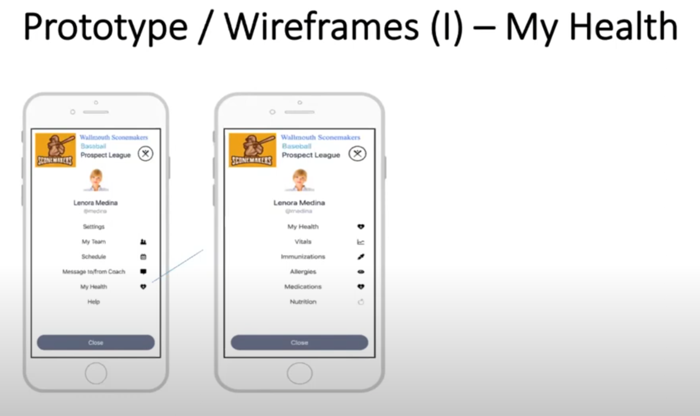
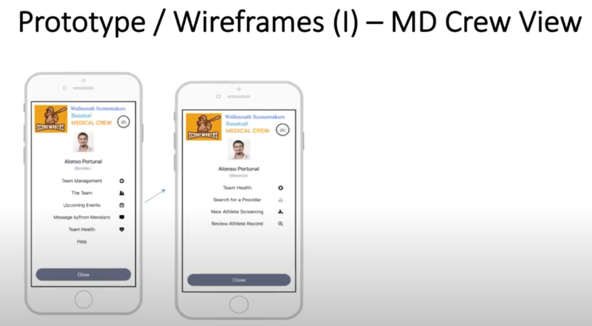

# Assignment Scenerios

- [Assignment Scenerios](#assignment-scenerios)
  - [Scenerio Introduction](#scenerio-introduction)
  - [Application Health Funcitonality](#application-health-funcitonality)
  - [Prototype Wireframes](#prototype-wireframes)
    - [My Health View Prototype Wireframe](#my-health-view-prototype-wireframe)
    - [MD Crew View Prototype Wireframe](#md-crew-view-prototype-wireframe)
  - [Closing Remarks](#closing-remarks)

## Scenerio Introduction

 * MySportsTeam ®: app designed to give **sports managers, coaches, and especially team members (athletes)** a great experience.
 * Functionality:
   * Manages sports team's workflow
   * Gives each member a **full view of the team schedule**
   * Allows **exchange of messages** between team members and coaches
   * Ensures all **the team's travel and logistic** needs are fulfilled on time.
 * Adopted in the first year by **1,305 professional sports teams, universities** and even high schools in the U.S.
 * After the first year, a **new need became clear: the team's health-related issues, from athletes' initial screenings to their current healthcare status**

## Application Health Funcitonality

 * Goals:
   * No duplicate data entry
   * Access for the medical crew and team members to the information they are allowed to see.

 * Functions:
   * Automate and standardize the transfer of new athletes' **healthcare screening information**
   * Allow the **team medical crew to review member healthcare information** created by any connected provider.
   * Provide a way to **locate healthcare services under constract** near the match venue or the athlete's home
   * Provide each team member with **access to his/her available healthcare information.**

## Prototype Wireframes

### My Health View Prototype Wireframe

### MD Crew View Prototype Wireframe

## Closing Remarks

 * Don't forget to read the **Methodology Document** before starting Unit 1 assignments.
 * Make sure you are comfortable with contents of the **Implementation Guides**, specifically with regards to:
   * Mandatory/Must Support elements
   * Vocabulary Bindings
   * Extensions
   * Search parameters
 * Prepare your development environment for [Java](https://www.jetbrains.com/idea/), [C#](https://visualstudio.microsoft.com/) or [Node.JS](https://nodejs.org/en)!
 * Thank you!

