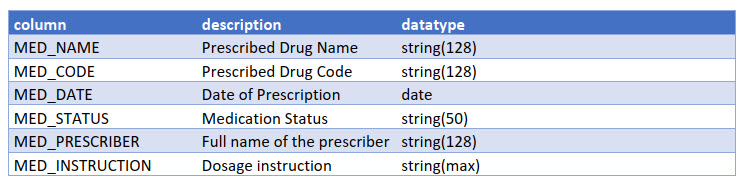

# U01-2: US Core FHIR R4/IPS Medication (Mapping)

## Description

Our Sport application needs to show active medications for the patient. The following mapping is needed from our simple medication display model to the Argonaut [MedicationRequest](https://www.hl7.org/fhir/us/core/StructureDefinition-us-core-medicationrequest.html) resource, to extract and **display only active medications for the patient.**

Now, we also want to process IPS resources and extract the same infomration, but we've noted that IPS uses MedicationStatement instead of MedicationRequest.

Your job is to write the [FHIRPath](http://hl7.org/fhirpath/) expressions with the Argonaut US Core **[5 Points]** and IPS mapping **[5 Points]**

### Additional Resources

* [FHIRPath Specification](http://hl7.org/fhirpath/)
* [FHIRPath Tutorial Video](https://www.youtube.com/watch?v=m0nwSwUxg58)
* [MedicationRequest Profile](http://hl7.org/fhir/us/core/StructureDefinition-uscore-medicationrequest.htm)

### Example Resources (Material Tools Folder)

* [medicationRequestUSCORE.json](../../Material%20Tools/medicationRequestUSCORE.json)
* [medicationStatementIPS.json](../../Material%20Tools/medicationStatementIPS.json)

> To retrieve the presciber in both cases, as we just ask for the requesters name, you can use the `display` element. You don't need to retrieve or resolve the referenced resource.

### FHIRPath Sandbox

[Sandbox](http://niquola.github.io/fhirpath-demo/#/)

#### Our Medication Display
