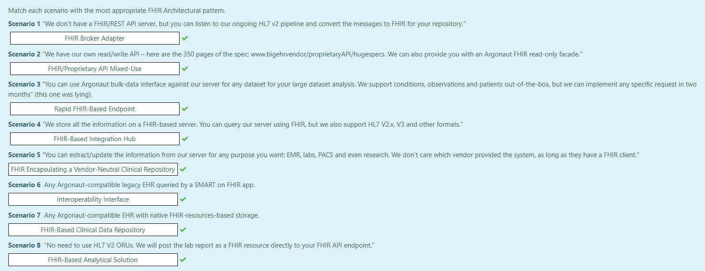

# Quiz

## Questions

### **Scenario 1:** 

"We don't have a FHIR/REST API server, but you can listen to our ongoing HL7 v2 pipeline and convert the messages to FHIR for your repository."

### **Scenario 2:**

"We have our own read/write API – here are the 350 pages of the spec: [www.bigehrvendor/proprietaryAPI/hugespecs](www.bigehrvendor/proprietaryAPI/hugespecs). We can also provide you with an 
Argonaut FHIR read-only facade."

### **Scenario 3:** 

"You can use Argonaut-bulk-data interface against our server for any dataset for your large dataset analysis. We support conditions, observations and patients opt-out-of-the-box but we can implement any specific request in two months." (this one was lying).

### **Scenario 4:** 

"We store all the information on a FHIR-based server. You can query our server using FHIR, but we also support HL7 V2.x, V3 and other formats."

### **Scenario 5:** 

"You can extract/update the information from our server for any purpose you want: EMR, labs, PACS and even research. We don’t care which vendor provided the system, as long as they have a FHIR client."

### **Scenario 6:** 

Any Argonaut-compatible legacy EHR queried by a SMART on FHIR app.

### **Scenario 7:** 

Any Argonaut-compatible EHR with native FHIR-resources-based storage.

### **Scenario 8:** 

"No need to use HL7 V2 ORUs. We will post the lab report as a FHIR resource directly to your FHIR API endpoint."

## Answers

