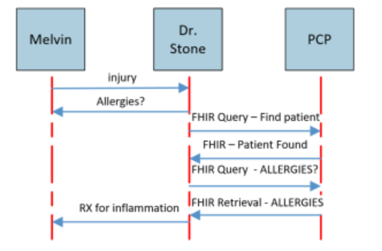
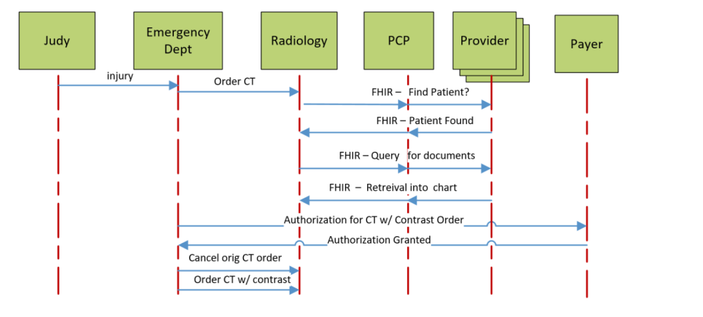
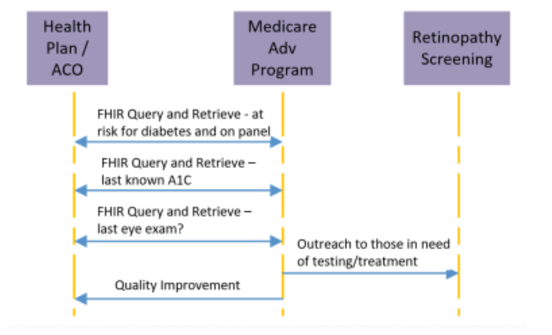

# U01-8: FHIR Use Case Proposal (Architecture)

## Description

Read the article in PDF format ["FHIR Use Case Proposal"](./files/FHIR-Use-Case-Proposal.pdf) by CareQuality at Material toolds folder. Starting on `Page 10`, there are descriptions of proposed scenarios called `Vignettes 1, 2 and 3`.

Which FHIR endpoints/resource types will be required to fullfill each scenarios? [15 Points]

## Vignettes

### Vignette 1: Improve Outcome

Melvin is a 56-year-old male with who lives with his family in the Bronx, New York. Every summer, they visit Melvin’s parents in Grady, South Carolina for a week-long vacation. Grady is a very rural town with a small hospital. While Melvin is visiting, he injures his shoulder and goes to the Grady Hospital & Clinic for treatment. While he is there, he meets with Dr. Ben Stone, who properly diagnoses the minor injury and initially wants to prescribe Melvin some Naproxen to help with his inflamed shoulder. Dr Stone asks Melvin if he is allergic to any medications as part of his diagnosis. Melvin states that he believes he’s allergic to something, but cannot recall the name of the drug. Melvin gives Dr. Stone the name and location of his Primary Care Physician, who would have this data in his chart. Both Grady Hospital and the PCP are with vendors who are Carequality implementers and FHIR capable. Dr. Stone does a quick query on his EHR tablet and is able to pull the allergy information (including the fact that Melvin is allergic to Naproxen) into the local Grady chart. Dr Stone, now armed with this new information, prescribes an alternative medicine that Melvin is not allergic to. A possible adverse outcome is avoided and Melvin is able to enjoy the rest of his family vacation.

### Vignette 2: Lower Cost

Judy is a 57 year old woman that comes into the Chicago Medical Emergency Department because she slipped
and fell on the ice. She is alert and answering questions. She has a serious mid-back contusion and a thoracic spine CT scan without contrast is initially ordered to evaluate the trauma. Down in the radiology department, the radiologist inquires about past surgeries and metal implants. Judy reveals to the radiologist that she had a previous back surgery and gives the radiologist the name and location of her Primary Care Physician. Judy also gives the names of other providers who have treated her over the years. The radiologist then utilizes the FHIR Directory to see what providers are part of the Carequality framework. The radiologist gets a couple of hits on these searches and proceeds to see what documents and other clinical data are available for the patient. The radiologist retrieves all of the relevant data for the patient and confirms the details of the previous back surgery. Due to that surgery, the study would need to be performed with contrast in order to be interpreted correctly. The hospital gets authorization from the payer for the study, while the physician is subsequently able to cancel the original order, and put the proper order into the system. A potentially wasteful test is avoided, quality of care is improved, resulting in time and money saved for the patient, provider, and payer

### Vignette 3: Quality Improvement

A health plan / ACO, i.e., an at-risk healthcare entity, contracted with an analytics company that is using a FHIRbased analytics app to analyze data for members of its Medicare Advantage Plan for a value-based care initiative. As a covered entity, the analytics company is subject to the privacy and security requirements of a "Business Associate" defined under HIPAA and authorized to retrieve PHI for Healthcare Operations permitted purposes. The FHIR app deployed targeted queries to collect both the last known A1C levels and the date of the last eye exam for the panel of patients identified per the quality measure specification. The health plan / ACO was able to stratify the data obtained using the FHIR queries, identify the highest risk patients based on diabetes control levels, and reach out to those who should be screened for early signs of diabetic retinopathy. The FHIRbased app allowed the health plan / ACO to manage their at-risk patients using a strategically limited set of data. This enabled the health plan / ACO to identify and intervene on behalf of patients at-risk, resulting in improved care for the patient, and quality performance for the health plan / ACO.

