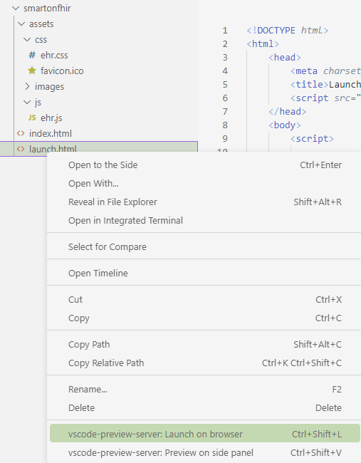
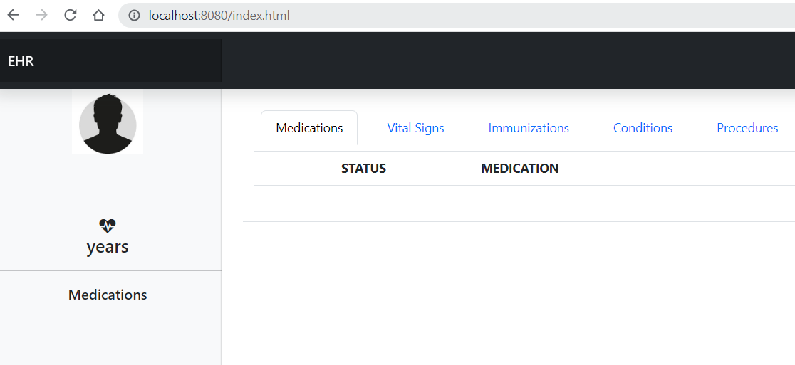

# What You Need

We think you have your environment ready from the previous unit.

Just in case:

 * Visual Studio Code (VSC) or any other HTML, JS and JSON editor
 * A localhost server.

You can use any web server you have. If you don't have one, we recommend installing a VSCode extension. https://marketplace.visualstudio.com/items?itemName=yuichinukiyama.vscode-preview-server

This extension provides a preview of HTML which executes your code on a web server. When you save files, this extension automatically reloads the browser. You can call these features from the context menu or editor menu. We are going to use Launch on browser.

 * Launch on browser (ctrl+shift+l): Open Web Page on default browser. You can check all the operations with web page.

    

You can test it using the index.html page

