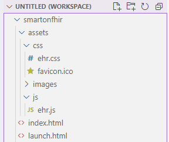
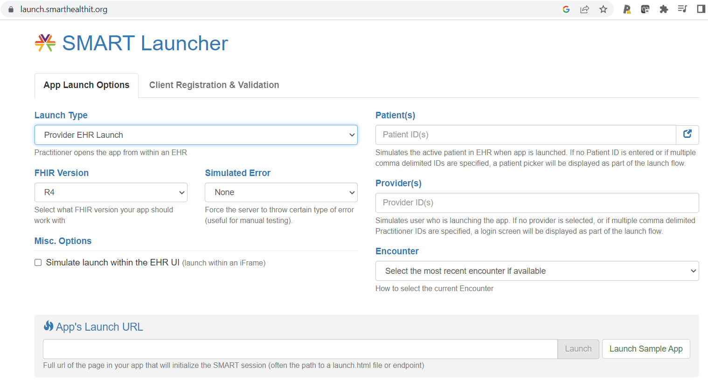
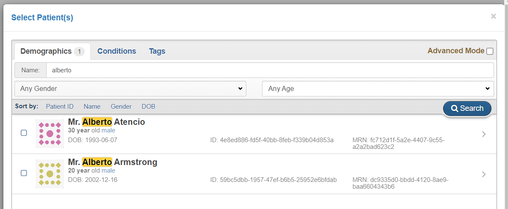
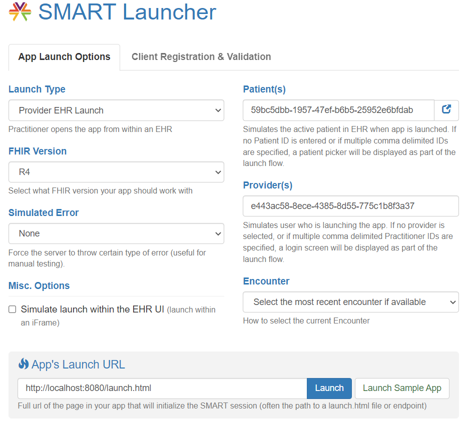
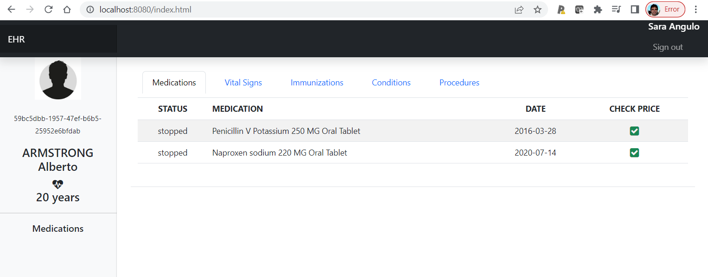
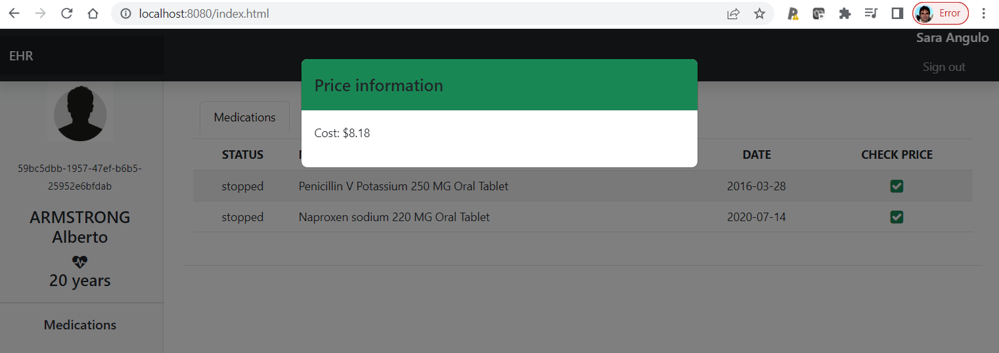

# Starting Point

#### We give you a project:

##### *smartonfhir project*

The project includes three key files. launch.html, index.html and ehr.js

In order to launch our SMART on FHIR app, we are going to use the SMART App Launcher (no registration required) https://launch.smarthealthit.org/

Options are:

 * Launch type : Provider EHR Launch

 * FHIR Version R4

 * Simulate error : none

 * Patient id : Simulates the active patient in EHR when the app is launched. You can browse and select any patient. If no Patient ID is entered, a patient picker will be displayed as part of the launch flow.

 * Provider id : Simulates user who is launching the app. If no provider is selected, a login screen will be displayed as part of the launch flow.

 * App's Launch URL : Full url of the page in your app that will initialize the SMART session (often the path to a launch.html file or endpoint)

Example :

Patient Alberto Amstrong

Provider : Dr Sara Angulo

URL : http://localhost:8080/launch.html

When you click on the Launch button, the magic happens and your app should display a website like this.

And when you click on the check price icon, the call to the CDS Hook service is executed and the information about the price is displayed.

