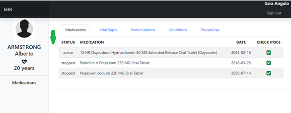

# Tips For Assignment #2

For this assignment you need to add a new column before the STATUS column in the medication grid

**Tip #2.1:** Find the missing element in the spec. https://hl7.org/fhir/us/core/StructureDefinition-us-core-medicationrequest.html

**Each MedicationRequest must have...**

You don't need to display the prescriber and the patient in the grid.

**Tip #2.2:** Where to add my code ? You need to modify two files. index.html to include the new column header in the grid template and the function createMedicationGrid at the ehr.js file.

**Tip #2.3:** You can´t modify the previous code. Just add the new element using the same strategy already used.

**Send your submission**

As the `index.html` is extremely easy, you just need to send the complete createMedicationGrid function code.